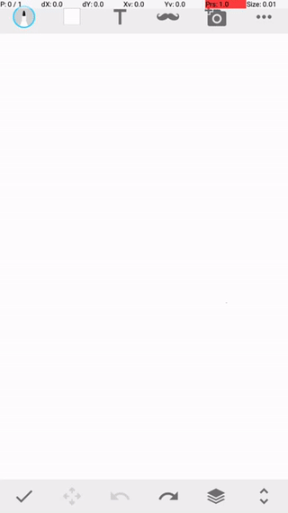

# android_touch


```
                  _           _     _   _                   _
  __ _ _ __   __| |_ __ ___ (_) __| | | |_ ___  _   _  ___| |__
 / _` | '_ \ / _` | '__/ _ \| |/ _` | | __/ _ \| | | |/ __| '_ \
| (_| | | | | (_| | | | (_) | | (_| | | || (_) | |_| | (__| | | |
 \__,_|_| |_|\__,_|_|  \___/|_|\__,_|  \__\___/ \__,_|\___|_| |_|

Copyright (c) 2017 Kunal Dawn <kunal.dawn@gmail.com>

This program is free software; you can redistribute it and/or modify it
under the terms of the GNU General Public License version 3 as published by
the Free Software Foundation.
```

## What is this?
To send touch events on android, you can use either adb or uiautomator. What I have observed that both of them
are painfully slow, basically if you want to send touch events via adb it will have very high latency and if you
want to send touch events via uiautomator in android instrumentation test case, it will have medium latency.

**android_touch is a dependency free native Android tool to send multitouch
inputs at very high speed with very low latency. This solves the problem of
high latency ADB/uiautomator multitouch inputs.**
    
    Latency of android_touch < uiautomator method < adb method

android_touch provides a http server for triggering multitouch events and
gestures on Android devices. It works without root if started via ADB. Touch
commands are sent to device as http request with JSON data.

Multitouch data is sent as JOSN which can contain any type of touch events such
as taps or complex gestures.

Android touch is built upon libevdev to communicate with touch input device.

## How do I use it?

#### Setting up device
All prebuilt executable binaries for android_touch can be located in "libs"
directory. You need to first determine what is your Android CPU Architecture, it can be one of the following :
1. armeabi
2. armeabi-v7a
3. arm64-v8a
4. x86
5. x86_64
6. mips
7. mips64

After you have determined CPU Architecture, you need to push "libs/{CPU_ARCH}/android_touch" to
devices "/data/local/tmp" directory.

For example if your CPU Architecture is "arm64-v8a" then run following command:
```bash
$ adb push libs/arm64-v8a/android_touch /data/local/tmp
```

#### Staring android_touch http server on device

To start android_touch http server on the android device run following command:
```bash
$ adb shell /data/loal/tmp/android_touch
``` 
This will start android_touch http server on port 8080

#### Forwarding android_touch http port to localhost

As the http server is running on Android device itself, to send request from your host
machine, you need to forward port 8080 of android to any port on host machine. For example
if you want to send http request on host machines 8080 port:
 
```bash
$ adb forward tcp:8080 tcp:8080
``` 

#### Sending request

Sending http request is straight forward, you can use any programming language and send
http request to android_touch server. For example in python you can use urllib2 to send
http request or on bash you can use curl tool to do the same.

Below is the example of sending a click touch event on coordinate 100x100 using curl tool:

```bash
$ curl -d '[{"type":"down", "contact":0, "x": 100, "y": 100, "pressure": 50}, {"type": "commit"}, {"type": "up", "contact": 0}, {"type": "commit"}]' http://localhost:8080
```

#### Understanding Multitouch JSON data and format

android_touch allows you send a large set of touch commands to device in one shot. You can send
individual touch commands by making separate http requests or can pack all touch commands and send
in one shot. Sending all touch data in one shot will obviously reduce latency.

android_touch http server only accepts json array of command objects. Following are the list of
touch commands:

<table>
  <tbody>
    <tr>
      <th>Command</th>
      <th>Description</th>
    </tr>
    <tr>
      <td><h4>down</h4></td>
      <td>
        <p>This sends a touch down event to android device for next commit, following are the required parameters</p>
        <table>
          <tr>
            <td><b>contact</b></td>
            <td>
              This specifies the touch contact id, contact id can be 0 to N-1 where N is the maximum number of supported touch contacts on that device. On android devices N is generally 5 to 10, that is 5 finger or 10 finger touch surface.
            </td>
          </tr>
          <tr>
            <td><b>x</b></td>
            <td>
              X coordinate of the touch down event on the device screen space.
            </td>
          </tr>
          <tr>
            <td><b>y</b></td>
            <td>
              Y coordinate of the touch down event on the device screen space.
            </td>
          </tr>
          <tr>
            <td><b>pressure</b></td>
            <td>
              Pressure of the touch down event, this can be any value if pressure sensitive event is not required.
            </td>
          </tr>
        </table>
      </td>
    </tr>
    <tr>
      <td><h4>move</h4></td>
      <td>
        This sends a touch move event to android device for next commit, following are the required parameters
        <table>
          <tr>
            <td><b>contact</b></td>
            <td>
             This specifies the touch contact id, contact id can be 0 to N-1 where N is the maximum number of supported touch contacts on that device. On android devices N is generally 5 to 10, that is 5 finger or 10 finger touch surface.
            </td>
          </tr>
          <tr>
            <td><b>x</b></td>
            <td>
              X coordinate of the touch move event on the device screen space.
            </td>
          </tr>
          <tr>
            <td><b>y</b></td>
            <td>
              Y coordinate of the touch move event on the device screen space.
            </td>
          </tr>
          <tr>
            <td><b>pressure</b></td>
            <td>
              Pressure of the touch move event, this can be any value if pressure sensitive event is not required.
            </td>
          </tr>
        </table>
      </td>
    </tr>
    <tr>
      <td><h4>up</h4></td>
      <td>
        This sends a touch up event to android device for next commit, following are the required parameters
        <table>
          <tr>
            <td><b>contact</b></td>
            <td>
              This specifies the touch contact id, contact id can be 0 to N-1 where N is the maximum number of supported touch contacts on that device. On android devices N is generally 5 to 10, that is 5 finger or 10 finger touch surface.
            </td>
          </tr>
        </table>
      </td>
    </tr>
    <tr>
      <td><h4>commit</h4></td>
      <td>
        This sends a commit command to the android device, until a commit command is sent, all previous changes to a touch contact using command such as <b>down</b>, <b>up</b> and <b>move</b> will not be visible on the device. <b>Please also note that you can not have more than one down,move or up for the same contact in one commit.
      </td>
    </tr>
    <tr>
      <td><h4>delay</h4></td>
      <td>
        This allows pauses between touch events, following are the required parameters
        <table>
          <tr>
            <td><b>value</b></td>
            <td>
              Time in milliseconds to wait.
            </td>
          </tr>
        </table>
      </td>
    </tr>
  </tbody>
</table>

Following are some valid json objects of above commands:

<table>
  <tr>
    <th>Command</th>
    <th>Example Object</th>
  </tr>
  <tr>
    <td>down</td>
    <td>{"type": "down", "contact": 0, "x": 100, "y": 100, "pressure": 50}</td>
  </tr>
  <tr>
    <td>move</td>
    <td>{"type": "move", "contact": 0, "x": 200, "y": 200, "pressure": 50}</td>
  </tr>
  <tr>
    <td>up</td>
    <td>{"type": "up", "contact": 0}</td>
  </tr>
  <tr>
    <td>commit</td>
    <td>{"type": "commit"}</td>
  </tr>
  <tr>
    <td>delay</td>
    <td>{"type": "delay", "value": 500}</td>
  </tr>
</table>

#### Some Examples

##### Single tap

Tap on coordinate 100x100 with 50 pressure

```json
[
  {"type": "down", "contact": 0, "x": 100, "y": 100, "pressure": 50},
  {"type": "commit"},
  {"type": "up", "contact": 0},
  {"type": "commit"}
]
```
##### Double tap

Double tap on coordinate 100x100 with 50 pressure with 100ms delay between taps and release at same time.

```json
[
  {"type": "down", "contact": 0, "x": 100, "y": 100, "pressure": 50},
  {"type": "commit"},
  {"type": "up", "contact": 0},
  {"type": "commit"},
  {"type": "delay", "value": 100},
  {"type": "down", "contact": 0, "x": 100, "y": 100, "pressure": 50},
  {"type": "commit"},
  {"type": "up", "contact": 0},
  {"type": "commit"}
]
```

##### Two finger tap

Tap on two coordinates 100x100 and 200x200 simultaneously and release simultaneously after 100ms

```json
[
  {"type": "down", "contact": 0, "x": 100, "y": 100, "pressure": 50},
  {"type": "down", "contact": 1, "x": 200, "y": 200, "pressure": 50},
  {"type": "commit"},
  {"type": "delay", "value": 100},
  {"type": "up", "contact": 0},
  {"type": "up", "contact": 1},
  {"type": "commit"}
]
```

Tap on two coordinates 100x100 and 200x200 simultaneously and release finger 1 after 100ms and finger 2 after 200ms

```json
[
  {"type": "down", "contact": 0, "x": 100, "y": 100, "pressure": 50},
  {"type": "down", "contact": 1, "x": 200, "y": 200, "pressure": 50},
  {"type": "commit"},
  {"type": "delay", "value": 100},
  {"type": "up", "contact": 0},
  {"type": "commit"},
  {"type": "delay", "value": 100},
  {"type": "up", "contact": 1},
  {"type": "commit"}
]
```

##### Swipe

Swipe between 100x100 and 400x100

```json
[
  {"type": "down", "contact": 0, "x": 100, "y": 100, "pressure": 50},
  {"type": "commit"},
  {"type": "move", "contact": 0, "x": 100, "y": 400, "pressure": 50},
  {"type": "commit"},
  {"type": "up", "contact": 0},
  {"type": "commit"}
]
```

Swipe gesture including points 100x100, 110x110, 120x130, 120x150

```json
[
  {"type": "down", "contact": 0, "x": 100, "y": 100, "pressure": 50},
  {"type": "commit"},
  {"type": "move", "contact": 0, "x": 110, "y": 110, "pressure": 50},
  {"type": "commit"},
  {"type": "move", "contact": 0, "x": 120, "y": 130, "pressure": 50},
  {"type": "commit"},
  {"type": "move", "contact": 0, "x": 120, "y": 150, "pressure": 50},
  {"type": "commit"},
  {"type": "up", "contact": 0},
  {"type": "commit"}
]
```

##### Complex gesture

See [example python script](example/example.py) for complex gesture generation, which generates following gesture:



## How do I build locally?
android_touch can be built for both linux and android platforms.
Linux build can be done using cmake and make where Android build
can be done using ndk-build.

Linux executable can be used with linux multitouch input device drivers
wheres Android executable can be used on android devices which contains
multitouch input touchscreen.

### Building for Android

```bash
android_touch$ ndk-build
[arm64-v8a] Compile        : android_touch <= libevdev.c
[arm64-v8a] Compile        : android_touch <= libevdev-names.c
[arm64-v8a] Compile        : android_touch <= libevdev-uinput.c
[arm64-v8a] Compile++      : android_touch <= jsoncpp.cpp
[arm64-v8a] Compile++      : android_touch <= Logging.cpp
[arm64-v8a] Compile++      : android_touch <= TouchInput.cpp
[arm64-v8a] Compile++      : android_touch <= TouchState.cpp
[arm64-v8a] Compile++      : android_touch <= Server.cpp
[arm64-v8a] Executable     : android_touch
[arm64-v8a] Install        : android_touch => libs/arm64-v8a/android_touch
[x86_64] Compile        : android_touch <= libevdev.c
[x86_64] Compile        : android_touch <= libevdev-names.c
[x86_64] Compile        : android_touch <= libevdev-uinput.c
[x86_64] Compile++      : android_touch <= jsoncpp.cpp
[x86_64] Compile++      : android_touch <= Logging.cpp
[x86_64] Compile++      : android_touch <= TouchInput.cpp
[x86_64] Compile++      : android_touch <= TouchState.cpp
[x86_64] Compile++      : android_touch <= Server.cpp
[x86_64] Executable     : android_touch
[x86_64] Install        : android_touch => libs/x86_64/android_touch
[mips64] Compile        : android_touch <= libevdev.c
[mips64] Compile        : android_touch <= libevdev-names.c
[mips64] Compile        : android_touch <= libevdev-uinput.c
[mips64] Compile++      : android_touch <= jsoncpp.cpp
[mips64] Compile++      : android_touch <= Logging.cpp
[mips64] Compile++      : android_touch <= TouchInput.cpp
[mips64] Compile++      : android_touch <= TouchState.cpp
[mips64] Compile++      : android_touch <= Server.cpp
[mips64] Executable     : android_touch
[mips64] Install        : android_touch => libs/mips64/android_touch
[armeabi-v7a] Compile thumb  : android_touch <= libevdev.c
[armeabi-v7a] Compile thumb  : android_touch <= libevdev-names.c
[armeabi-v7a] Compile thumb  : android_touch <= libevdev-uinput.c
[armeabi-v7a] Compile++ thumb: android_touch <= jsoncpp.cpp
[armeabi-v7a] Compile++ thumb: android_touch <= Logging.cpp
[armeabi-v7a] Compile++ thumb: android_touch <= TouchInput.cpp
[armeabi-v7a] Compile++ thumb: android_touch <= TouchState.cpp
[armeabi-v7a] Compile++ thumb: android_touch <= Server.cpp
[armeabi-v7a] Executable     : android_touch
[armeabi-v7a] Install        : android_touch => libs/armeabi-v7a/android_touch
[armeabi] Compile thumb  : android_touch <= libevdev.c
[armeabi] Compile thumb  : android_touch <= libevdev-names.c
[armeabi] Compile thumb  : android_touch <= libevdev-uinput.c
[armeabi] Compile++ thumb: android_touch <= jsoncpp.cpp
[armeabi] Compile++ thumb: android_touch <= Logging.cpp
[armeabi] Compile++ thumb: android_touch <= TouchInput.cpp
[armeabi] Compile++ thumb: android_touch <= TouchState.cpp
[armeabi] Compile++ thumb: android_touch <= Server.cpp
[armeabi] Executable     : android_touch
[armeabi] Install        : android_touch => libs/armeabi/android_touch
[x86] Compile        : android_touch <= libevdev.c
[x86] Compile        : android_touch <= libevdev-names.c
[x86] Compile        : android_touch <= libevdev-uinput.c
[x86] Compile++      : android_touch <= jsoncpp.cpp
[x86] Compile++      : android_touch <= Logging.cpp
[x86] Compile++      : android_touch <= TouchInput.cpp
[x86] Compile++      : android_touch <= TouchState.cpp
[x86] Compile++      : android_touch <= Server.cpp
[x86] Executable     : android_touch
[x86] Install        : android_touch => libs/x86/android_touch
[mips] Compile        : android_touch <= libevdev.c
[mips] Compile        : android_touch <= libevdev-names.c
[mips] Compile        : android_touch <= libevdev-uinput.c
[mips] Compile++      : android_touch <= jsoncpp.cpp
[mips] Compile++      : android_touch <= Logging.cpp
[mips] Compile++      : android_touch <= TouchInput.cpp
[mips] Compile++      : android_touch <= TouchState.cpp
[mips] Compile++      : android_touch <= Server.cpp
[mips] Executable     : android_touch
[mips] Install        : android_touch => libs/mips/android_touch
```

### Building for Linux

```bash
android_touch$ mkdir build
android_touch$ cd build
android_touch/build$ cmake ..
-- The C compiler identification is GNU 6.3.0
-- The CXX compiler identification is GNU 6.3.0
-- Check for working C compiler: /usr/bin/cc
-- Check for working C compiler: /usr/bin/cc -- works
-- Detecting C compiler ABI info
-- Detecting C compiler ABI info - done
-- Detecting C compile features
-- Detecting C compile features - done
-- Check for working CXX compiler: /usr/bin/c++
-- Check for working CXX compiler: /usr/bin/c++ -- works
-- Detecting CXX compiler ABI info
-- Detecting CXX compiler ABI info - done
-- Detecting CXX compile features
-- Detecting CXX compile features - done
-- Configuring done
-- Generating done
-- Build files have been written to: /home/kunaldawn/workspace/dev/android_touch/build

android_touch/build$ make
Scanning dependencies of target android_touch
[ 11%] Building CXX object CMakeFiles/android_touch.dir/jni/src/Logging.cpp.o
[ 22%] Building CXX object CMakeFiles/android_touch.dir/jni/src/Server.cpp.o
[ 33%] Building CXX object CMakeFiles/android_touch.dir/jni/src/TouchInput.cpp.o
[ 44%] Building CXX object CMakeFiles/android_touch.dir/jni/src/TouchState.cpp.o
[ 55%] Building C object CMakeFiles/android_touch.dir/jni/vendor/libevdev/libevdev-names.c.o
[ 66%] Building C object CMakeFiles/android_touch.dir/jni/vendor/libevdev/libevdev-uinput.c.o
[ 77%] Building C object CMakeFiles/android_touch.dir/jni/vendor/libevdev/libevdev.c.o
[ 88%] Building CXX object CMakeFiles/android_touch.dir/jni/vendor/jsoncpp/jsoncpp.cpp.o
[100%] Linking CXX executable android_touch
[100%] Built target android_touch
```

## How do I debug whats happening?

If you are running on Android, then all verbose logs are dispatched to logcat, you can see internal working by:

```bash
$ adb logcat | grep android_touch
```

For example following is the debug output in logcat for below command:

```bash
$ curl -d '[{"type":"down", "contact":0, "x": 100, "y": 100, "pressure": 50}, {"type": "commit"}, {"type": "up", "contact": 0}, {"type": "commit"}]' http://localhost:8080
```

```text
android_touch: TouchInput : down : 0 : 100 : 100 : 50
android_touch: TouchInput : writeInputEvent : 3 : 47 : 0
android_touch: TouchInput : writeInputEvent : 3 : 57 : 1
android_touch: TouchInput : writeInputEvent : 3 : 48 : 6
android_touch: TouchInput : writeInputEvent : 3 : 50 : 4
android_touch: TouchInput : writeInputEvent : 3 : 53 : 100
android_touch: TouchInput : writeInputEvent : 3 : 54 : 100
android_touch: TouchInput : writeInputEvent : 0 : 0 : 0
android_touch: TouchInput : up : 0
android_touch: TouchInput : writeInputEvent : 3 : 47 : 0
android_touch: TouchInput : writeInputEvent : 3 : 57 : -1
android_touch: TouchInput : writeInputEvent : 0 : 0 : 0
```

## Who is using it?

Used internally by [Bobble Keyboard](https://bobbleapp.me/home) for their keyboard automation.

## In my device its not working, what should I do?

Provide a patch pull request and it will be merged after review.